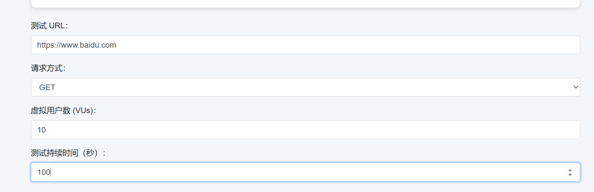
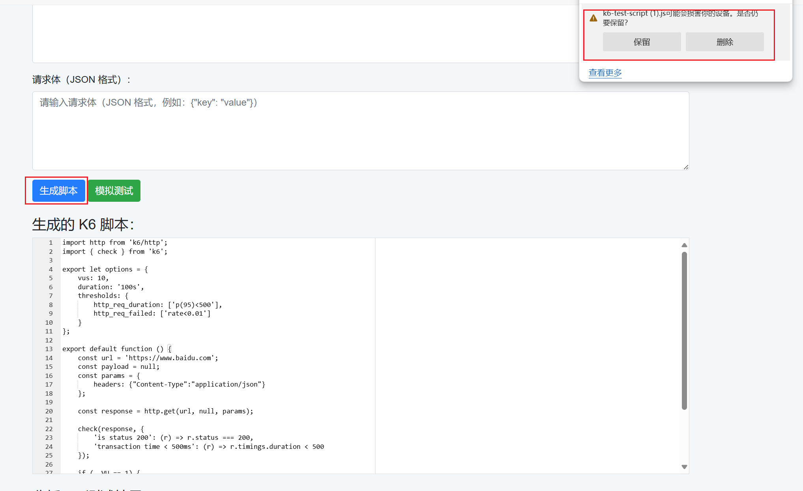
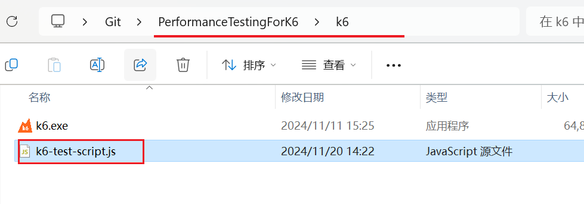
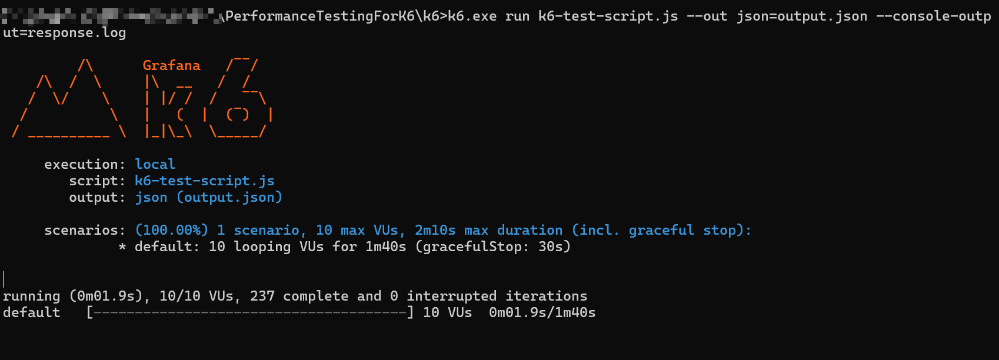
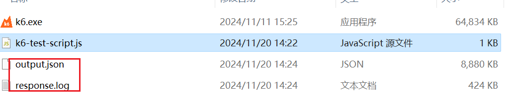
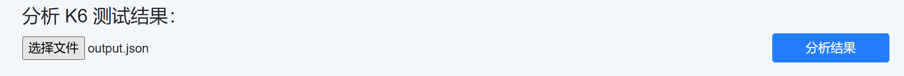
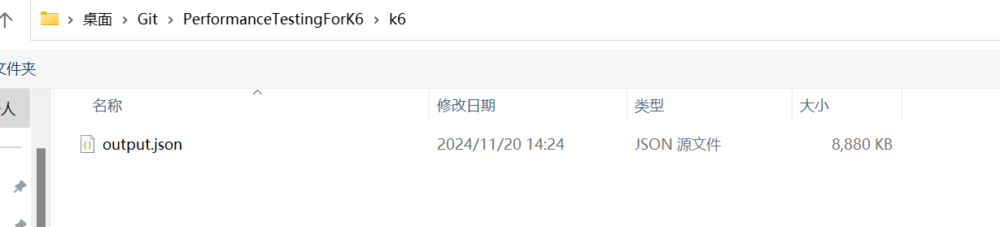
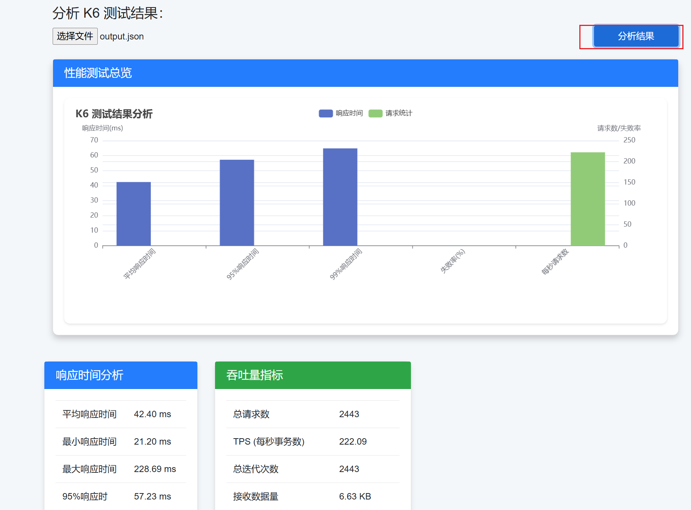

# PerformanceTestingForK6
快速生成测试的K6脚本,并对执行结果进行可视化展示

## 生成脚本

简单的配置脚本测试方式

点击生成脚本后 会生成对应的脚本

将脚本移动到K6文件下

执行命令 `k6.exe run 脚本名称.js --out json=output.json --console-output=response.log`

测试完成后生成两个文件

`output.json`  存储的是测试结果

`response.log`  存储的是请求响应数据

## 分析结果

选择刚刚输出的数据

点击分析结果

