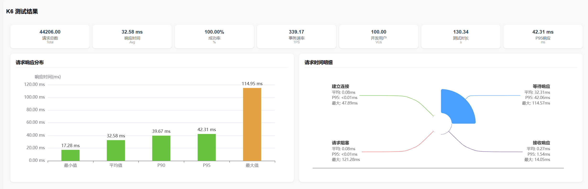
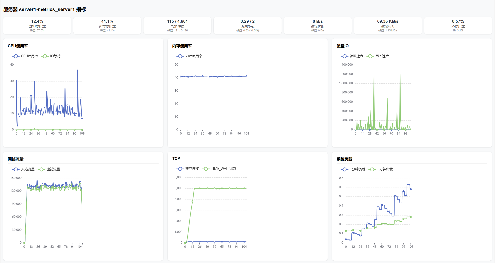

## 简介

该项目主要是用来对于 K6 的测试结果进行可视化处理，并生成测试报告。

## 项目结构

- `性能脚本/monitor.sh` 该文件是服务器性能监控脚本，主要用于监控服务器的 CPU、内存、磁盘、网络等性能指标。
- `k6/script` 该文件夹是 K6 的测试脚本，主要用于进行压力测试。内部已存在一些常用的测试脚本方便更改。
- `k6/report` 该文件夹是 K6 的测试报告，主要用于生成测试报告。
- `k6/k6.exe` 该文件是 K6 的可执行文件，主要用于执行测试脚本。
- `k6/index.html` 该文件是快速将 fetch 格式转换成脚本适用的 JSON 格式。

## 功能

- **实时监控**：通过 `monitor.sh` 脚本实时监控服务器性能指标,生成测试数据文件。
- **压力测试**：使用 K6 进行高并发压力测试，评估系统性能。
- **报告生成**：可视化测试数据，生成测试报告。

## 使用方法

1. 首先需要安装 K6，安装方法可以参考 [K6 官网](https://k6.io/docs/getting-started/installation/)。
2. 将 `k6.exe` 文件放入 K6 的安装目录下。
3. 将 `report.html` 文件放入 K6 的安装目录下。
4. 将 `monitor.sh` 文件放入服务器中，并赋予执行权限。
5. 运行 `monitor.sh` 文件，执行 `./monitor.sh 服务器名称 监控时间` 监控服务器性能。
6. 运行 `k6.exe` 文件，执行 `k6.exe run 脚本` 测试脚本。
7. 运行 `report.html` 文件，上传服务器数据和测试数据，查看测试报告。

## 测试报告页面

上传文件

查看报告

## 注意事项

1. 测试脚本中的 `BASE_URL` 需要根据实际情况进行修改。
2. 测试报告中的 `heatmapData` 需要根据实际情况进行修改。
3. 测试报告中的 `服务器名称` 需要根据实际情况进行修改。
4. 通常服务器监控时间需要大于测试时间。 比如测试时间设置为30s，那么监控时间需要设置为60s。  

## 贡献

欢迎任何形式的贡献！如果你有想法或建议，请提交问题或拉取请求。请遵循以下步骤：

1. Fork 本项目。
2. 创建你的特性分支 (`git checkout -b feature/YourFeature`)。
3. 提交你的更改 (`git commit -m 'Add some feature'`)。
4. 推送到分支 (`git push origin feature/YourFeature`)。
5. 创建一个新的 Pull Request。

## 常见问题

### Q1: 如何查看监控数据？

A1: 运行 `monitor.sh` 脚本后，等待脚本执行完毕在同目录下生成 `"metrics_xxxx.json`文件。

### Q2: 测试报告生成失败怎么办？

A2: 请确保上传的文件格式正确，并检查 K6 和相关依赖是否已正确安装。

## 更新日志

2024-11-28 初始化项目

